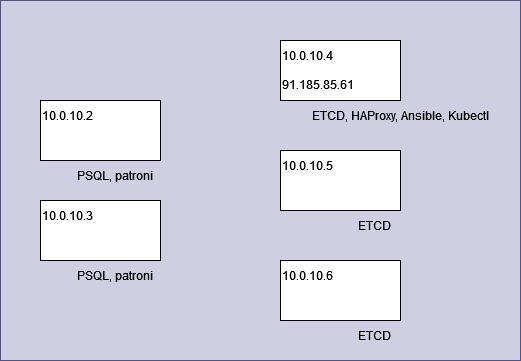

sre course 2023q3
### ДЗ 1 по курсу SRE 
## Схема инфраструктуры в облаке 

## ansible playbook -> каталог ansible_here

Здесь взят монструозный плейбук из примера. Выпилены многомегабайтные образы и т.п. Оставлено остальное как есть. 

Чуть поправлен под задачу vars/main.yaml. Переписан inventory в соответствии с поднятой инфраструктурой. 
Запускается как и оригинальный ```ansible-playbook deploy_pgcluster.yml``` . 

## helm chart -> каталог helm_herre

Собственно интересен по сути только values.yaml. Почти все в нем. Последняя версия образа , лимиты, ingress. Не припомню чтобы что-то еще там отличалось от дефолта.

Чуть поправлен templates/serviceaccount.yaml. Там подтвержденный баг. Сгенеренный файл не работает - напутали с отступами.

В templates/deploymett.yaml поиграл с параметрами проб. Почему-то было не мало порченых проб на разных других таймерах. Там же env. для подключения контейнера api к базам.
Остальное - как сгенерено, так и оставлено. 
